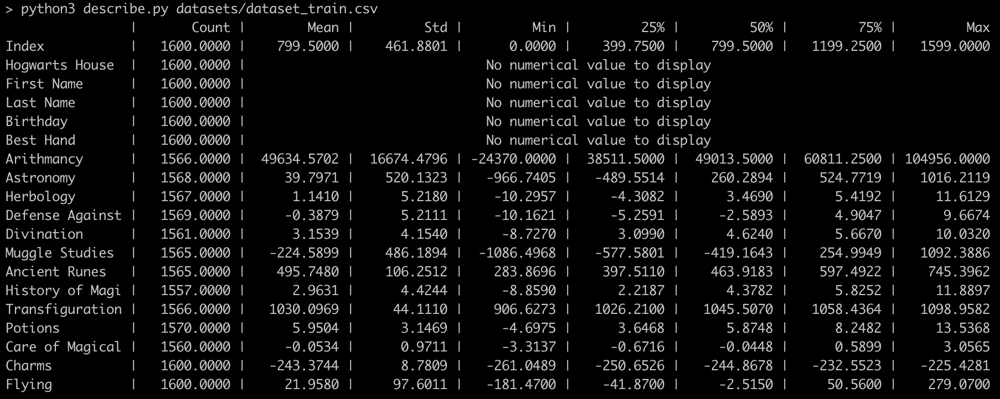
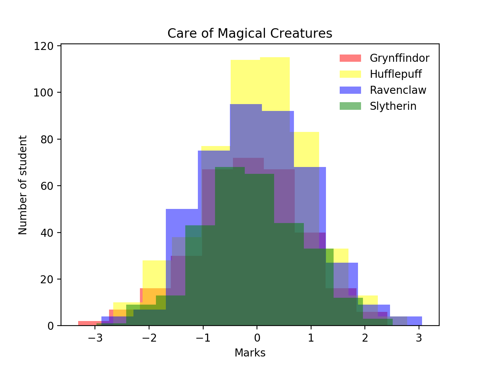
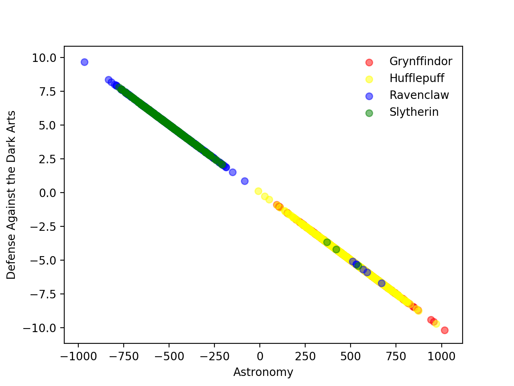
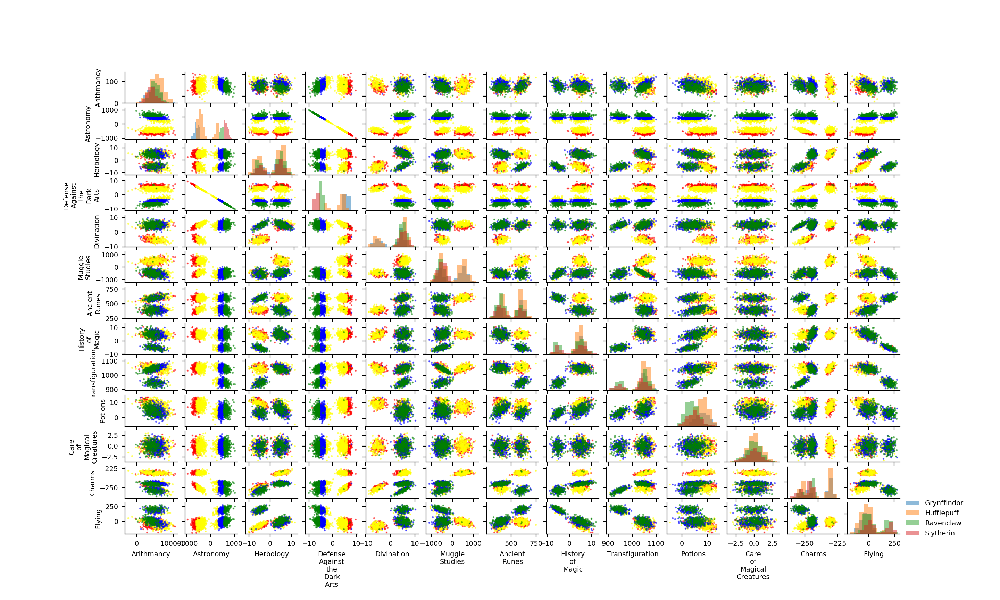

# DSLR

About
-----
> Let's discover Data Science through this project in the reconstruction of the Hogwarts Magic Hat!

This is the second project of the Artificial Intelligence branch at School 42 Paris

Math
----
Feature Scaling:


Logistic Regression:


Installation
------------
Run `make install`

Usage
-----
`python3 describe.py dataset`
* Display informations on all numerical features

`python3 histogram.py`
* Answer the following question: Which Hogwarts course has a homogeneous score distribution between the four houses ?

`python3 scatter_plot.py`
* Answer the following question: What are the two features that are similar ?

`python3 pair_plot.py`
* Show a pair_plot of all numerical features present in `datasets/dataset_train.csv`

`python3 logreg_train.py [-h] [-v] dataset`
* -h: Show help message and exit
* -v: Show model
* Train a model from an input dataset

`python3 logreg_predict.py dataset weights`
* Generate a file with all predictions for a given dataset


### Example
`python3 describe.py datasets/dataset_train.csv`
<div align="center">
  
</div>

`python3 histogram.py`
<div align="center">
  
</div>

`python3 scatter_plot.py`
<div align="center">
  
</div>

`python3 pair_plot.py`
<div align="center">
  
</div>

First we need to train our model with the provided dataset

```
> python3 logreg_train.py -v datasets/dataset_train.csv
Misclasified samples: 6
Accuracy: 0.99
```

This will save the weights trained in `./datasets/weights.csv`

```
> cat datasets/weights.csv
Gryffindor,Hufflepuff,Ravenclaw,Slytherin,Mean,Std
...
```

Then, to make predictions for a given dataset

`python3 logreg_predict.py datasets/dataset_test.csv datasets/weights.csv`

This will generate a file with all predictions in `./houses.csv`

```
> cat houses.csv
Index,Hogwarts House
...
```


##### Project done in 2019
